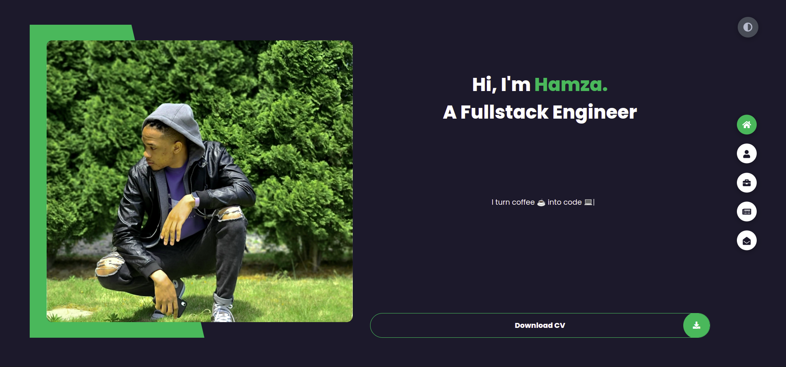
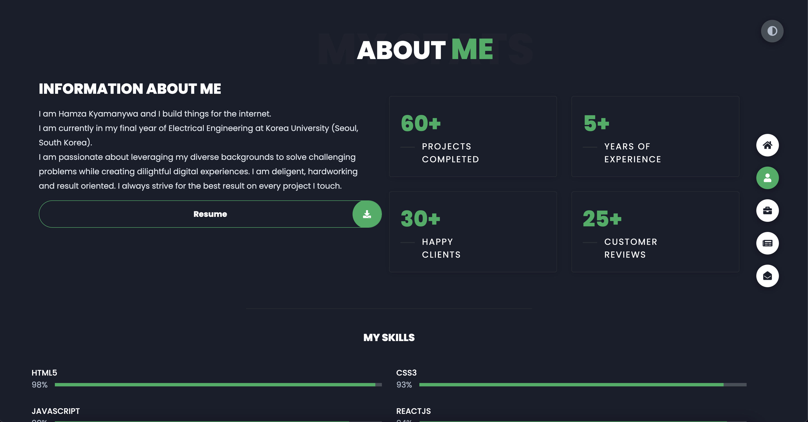
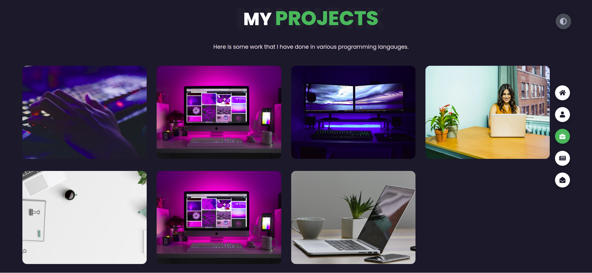
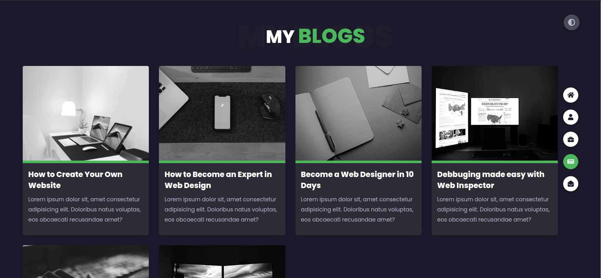
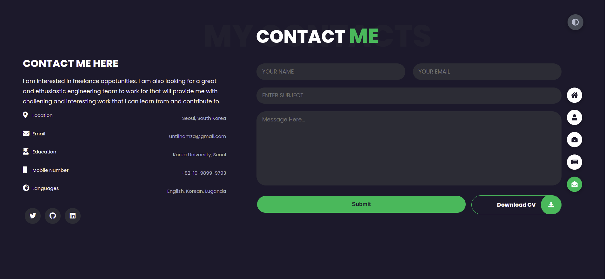

# My Portfolio 🔥

> https://hsanshine.github.io/

:star: Follow me on GitHub

### Website Preview

#### Home Page

#### About Page

#### Projects Page

#### Blogs Page

#### Contacts Page

## Features 📋

⚡️ Fully Responsive\
⚡️ Valid HTML5 & CSS3\
⚡️ Typing animation using `Typed.js`\
⚡️ Easy to modify

## Sections 📚

✔️ About\
✔️ Projects\
✔️ Blogs\
✔️ Contact\
✔️ Experience\

## Tools Used 🛠️

- <b>GitHub Pages</b> - To host my static website (HTML, CSS, JS).

## Contributing 💡

#### Step 1

- **Option 1**

  - 🍴 Fork this repo!

- **Option 2**
  - 👯 Clone this repo to your local machine.

#### Step 2

- **Build your code** 🔨🔨🔨

## License

- **[MIT license](http://opensource.org/licenses/mit-license.php)**
